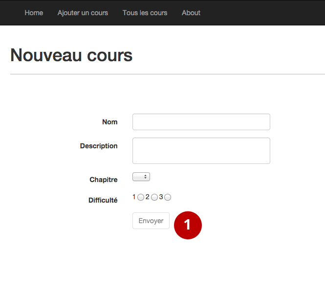
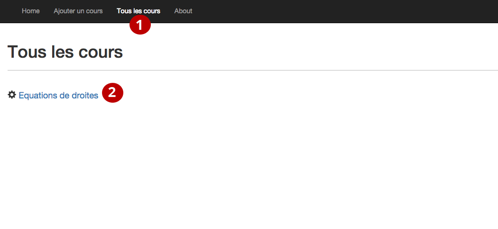
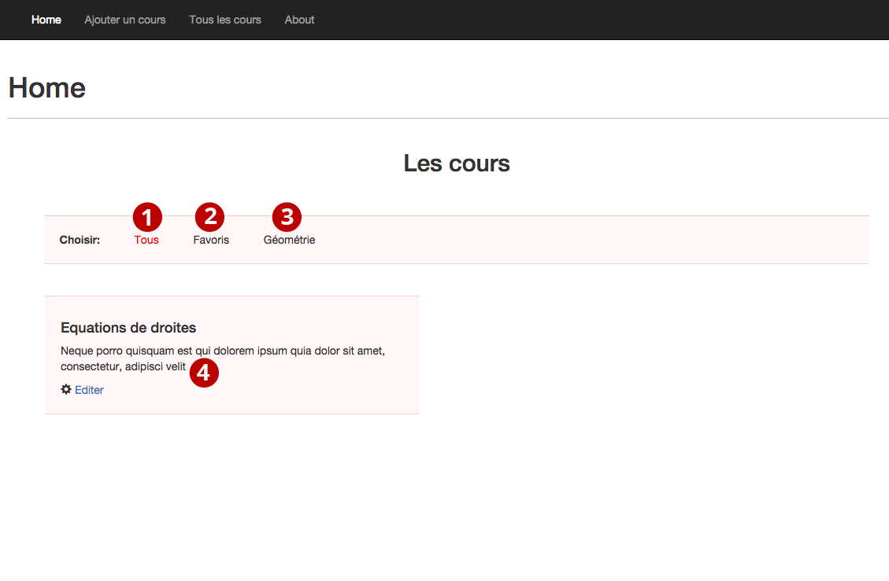
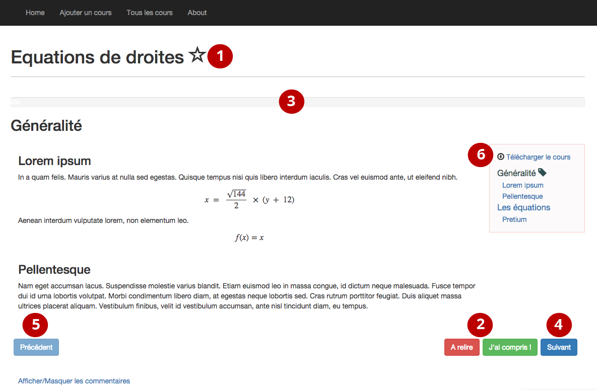

===============
Fonctionnalités
===============

###############
Les professeurs
###############

Les comptes "professeurs" du site web ont la possibilité de rédiger des cours complets qui sont ensuite consultables par les autres utilisateurs du site, principalement des élèves. L'objectif est de pouvoir offrir du contenu théorique d'apprentissage en complément de partie pratique. Les enseignants disposent d'un outil formidable pour écrire des compléments au cours de base, afin d'approfondir des éléments ou de les clarifier pour les élèves en difficulté.

*********
Création
*********

La première étape du processeur de rédaction consiste à créer le cours en entrant les informations basiques du cours, à savoir le nom, la description, la catégorie et la difficulté. En ce qui concerne le nom et la description, ces champs parlent d'eux-mêmes. Il s'agit de saisir les informations pertinentes qui correspondent au contenu du cours afin que celui-ci puisse attirer les utilisateurs. Pour la catégorie, il faut choisir parmi les chapitres proposés, qui sont eux-mêmes regroupés par thèmes. Par exemple, un cours sur "les tangentes" se place dans le chapitre "Les cercles" qui lui-même est dans le thème "Géométrie". Ainsi, les différentes ressources du site sont classées, et l'élève retrouve facilement la matière qui l'intéresse. Finalement, le professeur choisit la difficulté, sur une échelle de 1 à 3, de facile à difficile.

Tous les champs sont obligatoires. Une fois les champs dûment complétés, il suffit à l'auteur de cliquer sur le bouton "Envoyer" (1) pour être redirigé sur la page de rédaction où il peut commencer à écrire. 

    Création d'un cours

**********
Rédaction
**********

Structurer son cours
====================

Pour structurer son cours, l'auteur peut tout d'abord créer plusieurs pages ayant chacune un titre (1). Ensuite, dans chacune de ces pages, le contenu se découpe en plusieurs sections avec un titre (2) et un contenu (3). L'avantage de cette structure est que le site génère automatiquement un sommaire interactif du cours, en se basant sur le titre des pages et celui des sections.

L'action de créer des pages ou des sections et de modifier leur contenu se fait de manière claire, simple et surtout rapide. Le professeur travaille sans jamais devoir recharger sa page, action généralement lente. Pour ajouter une section, un bouton se trouve en bas de page (4). En cliquant dessus, une nouvelle zone d'édition va simplement apparaître. En bas de la page se trouvent le bouton (5) pour ajouter une nouvelle page, ainsi que la liste des différentes pages déjà créées (6). L'on peut donc, soit créer une page en cliquant sur le bouton (5), ce qui a pour effet d'afficher une nouvelle page vierge, soit encore naviguer entre les pages du cours pour éditer leur contenu en cliquant sur le numéro des pages (6). Il se peut aussi que l'on veuille réorganiser les sections dans un ordre différent, ou supprimer une section. Cette action est tout à fait possible; à côté de chacune des sections se trouve trois boutons (7): celui pour supprimer la section et les deux autres pour la monter ou la descendre. Lorsque l'on clique sur l'un des trois, la page est mise à jour automatiquement et instantanément.

En ce qui concerne l'enregistrement, il se fait automatiquement toutes les 30 secondes. De plus, au cas où l'on crée ou change une page, ou réorganise les sections, lorsque l'on prévisualise le cours, publie ou retire, de même que si l'on quitte la page, le cours est aussi sauvegardé. Il y a un bouton "Enregistrer" (8) en haut de la page pour faire une sauvegarde manuelle. L'heure du dernier enregistrement est affichée à la gauche du bouton.

Mise en forme
==============

Pour mettre en forme le texte de son cours, le rédacteur utilise la syntaxe populaire *Markdown*. La syntaxe consiste à mettre dans le texte des marques avec des symboles qui sont ensuite interprétés, soit comme des titres, des images, du texte gras, etc. Par exemple, pour mettre en italique, on entoure un mot avec "*". Ainsi l'on peut facilement souligner du texte, ajouter des images, faire des tableaux et des listes, etc. S'il n'est pas encore à l'aise avec la syntaxe, le professeur peut à tout moment cliquer sur le bouton d'aide (9) en haut de la page, représenté par un point d'interrogation. Il découvre alors des liens pour avoir un rapide aperçu de l'ensemble des fonctionnalités du *Markdown*. 

De plus, comme les cours visent avant tout un contenu mathématique, l'auteur peut (et doit) baliser le contenu mathématique. Ainsi celui-ci est formaté pour le rendu final et donc correctement affiché. La notation à utiliser pour les formules mathématique est celle du populaire format *LaTex*. Par conséquent, il suffit au professeur de mettre les balises et d'écrire ensuite sa formule mathématique en utilisant la syntaxe *LaTex* (10). Il y a deux types de balises. ``\(`` ... ``\)`` est utilisée pour intégrer des mathématiques directement dans le texte. La balise ``||`` est utilisée pour un affichage en bloc, c'est-à-dire que la formule est sur une nouvelle ligne, séparée du texte. A l'instar du *Markdown*, on peut se référer à la section d'aide pour se familiariser avec la syntaxe *LaTex* (9).

L'auteur n'ayant pas un aperçu direct du rendu de son texte, il peut cliquer sur le bouton en haut "Aperçu" (11) pour regarder comment le contenu est réellement affiché. Il n'a pas besoin de sauvegarder avant de faire l'aperçu. Une fois sur la page de prévisualisation, il peut retourner à la rédaction du cours en cliquant sur "Retour" en haut à gauche.

Ajouter des médias
==================

Evidemment, l'auteur peut inclure des vidéos et des images pour enrichir son contenu. Il peut ajouter une image provenant d'internet en utilisant la syntaxe *Markdown* et le lien de l'image, tandis que pour la vidéo il peut en inclure une provenant de Youtube avec le même procédé que pour l'image (voir aide *Markdown*).

Modifier les informations de base
=================================

Lorsque l'enseignant désire modifier les informations saisies lors du processus de création, il peut cliquer sur le lien "Editer" (12) à côté du titre du cours. Il est alors sur une page avec le même formulaire qu'à la création du cours. L'auteur peut donc éditer le titre, la description, la catégorie et la difficulté et cliquer sur "Envoyer". Finalement, il est possible de retourner sur la page de rédaction en cliquant sur "Retour" en haut à gauche.

Publier un cours
================

Par défaut, le cours créé par un professeur n'est pas visible par les utilisateurs du site, afin de laisser à l'auteur le temps de rédiger le cours en entier. Lorsqu'il estime le cours prêt, il peut tout simplement cliquer sur le bouton "Publier" (13) tout en haut de la page pour rendre le cours visible. Il peut bien sûr retirer son cours de la liste à tout moment s'il désire apporter des modifications ou estime qu'il ne doit plus être lisible sur le site.

.. figure:: images/edit.png
    :scale: 60%
    :align: center

    Edition d'un cours

Retrouver son cours
===================

En se rendant sur "Tous les cours" (1), le professeur voit la liste de tous les cours, qu'ils soient publiés ou non. S'il clique sur le titre d'un de ceux-ci (2), il retourne sur l'interface d'édition de son cours et peut y apporter les modifications désirées.

    Tous les cours des professeurs

##############
Les étudiants
##############

La plupart des fonctionnalités nécessitent que l'on soit connecté au site.

****************
Trouver un cours
****************

Tous les cours publiés sont consultables par les utilisateurs du site. S'ils se rendent sur la page "Home", les étudiants ont la liste du contenu mis à leur disposition. Ils peuvent afficher tous les cours (1), seulement leurs favoris (2), ou alors trouver un cours par thème (3). Grâce à cette organisation, chaque élève peut trouver rapidement et efficacement le cours qui répond à ses besoins. Lorsqu'un cours l'intéresse, il lui suffit de cliquer dessus (4) et il est alors redirigé sur la page de lecture du cours.

    Tous les cours

*************
Lire un cours
*************

Les favoris
=============

S'il apprécie particulièrement un cours, le trouve utile ou veut le retrouver facilement par la suite, l'étudiant peut l'ajouter en favoris, à l'instar des favoris d'un navigateur par exemple. Pour ce faire, il y a une étoile en haut de chaque page (1) de lecture d'un cours. Elle est d'abord vide, ce qui signifie que le cours n'appartient pas aux favoris de l'étudiant. Si l'on clique dessus, l'étoile devient pleine et signifie que le cours est ajouté à la liste de favoris. A l'inverse, l'élève peut évidemment retirer un favori de la même manière qu'il l'a ajouté. Sa liste de favoris peut être retrouvée sur la page d'accueil comme expliqué précédemment.

La progression
==============

L'élève profite également d'un système d'indication de sa progression. L'objectif est de pouvoir faciliter son apprentissage à travers le cours, l'aider à suivre et identifier ses zones de faiblesse. En bas de chaque page d'un cours se situent deux boutons intitulés "Compris" et "A relire" (2). A la fin de sa lecture de la page, il est conseillé à l'élève de cliquer sur l'un des deux boutons. En effet, cela lui permettra ensuite de situer sa progression dans le cours. Basée sur les indications de l'utilisateur, une barre de progression en haut de la page (3) indique le nombre de pages comprises par rapport au nombre total de pages du cours. Quand il clique sur l'un des deux boutons, le lecteur est directement dirigé vers la page suivante et sa barre de progression est mise à jour. Il est évidemment possible de simplement cliquer sur "Suivant" (4) pour aller à la page suivante sans marquer la progression. Il y a aussi un bouton "Précédent" (5) pour se rendre à la page précédente.

Télécharger le cours
====================

Il est souvent pratique de pouvoir lire un cours sans connexion internet ou de pouvoir l'imprimer pour le lire sans ordinateur. C'est pourquoi il est possible d'obtenir le cours en version PDF ! Lorsque l'étudiant lit un cours, il peut voir un lien "Télécharger le cours" dans le menu à droite (6). Il suffit de cliquer sur le lien et après quelques instants l'on obtient le PDF.

    Lire un cours

Les commentaires
=================

Chaque lecteur a la possibilité de commenter un cours, pour le complimenter, émettre une critique ou poser une question. En bas de chaque page du cours se trouve un lien "Afficher/masquer les commentaires" (1). Cela permet de montrer tous les commentaires ou de les cacher en cliquant dessus. Dans cette section, l'utilisateur voit chaque commentaire du cours avec son auteur et la date de publication (2). En dessous des commentaires se trouve une zone de texte (3) dans laquelle l'on peut écrire son propre commentaire. Au fur et à mesure que l'on tape son message, le commentaire s'affiche dans la liste (4), mais n'est pas encore envoyé. Une fois le texte rédigé, il faut le poster en cliquant sur le bouton "Envoyer" (5) pour qu'il soit instantanément visible par les autres lecteurs.

.. figure:: images/comments.png
    :scale: 60%
    :align: center

    Les commentaires