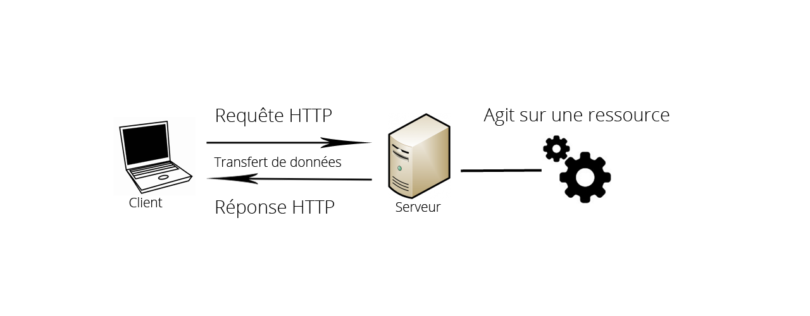

===========
RestLess
===========

#############
Présentation
#############

`RestLess <https://github.com/dobarkod/django-restless>`_ est un set d'outils permettant de faciliter l'implémentation d'une API JSON dans Django. Il a l'avatange d'être léger et facile à utiliser comme nous le verrons par la suite. Une API - Application Programming Interface - est basiquement une application qui offre des services accessible par une autre application et le JSON est un format de données dans le style d'un dictionnaire ``{"nom" : "Keran", "prenom" : "Kocher"}``. On appelle donc une API JSON, une application qui fournit des données en format JSON. Concrétement il s'agit d'une série d'URLs qui fournissent le contenu de différentes tables de la BD en format JSON. Quand on se rend sur une de ces URLs, on ne voit pas une page HTML comme on a l'habitude de voir, mais simplement le dictionnaire de données affiché. Sur notre site web rendez-vous sur http://webmath.com/courses/api/themes pour voir à quoi cela ressemble.

Dans la présentation concernant AngularJS, nous avons vu que le framework n'était pas capable de communiquer directement avec une base de données, c'est une limitation de JavaScript, qui s'exécute côté client - sur l'ordinateur de l'utilisateur, opposé de côté serveur - dans notre cas. Pour palier ce problème on utilise donc un language intermédiaire qui est capable de communiquer avec une BD et qui s'exécute côté serveur, c'est le cas de Python et son framework Django. Django va donc chercher les données dans la BD, les transforme en format JSON puis les sert. Il suffit ensuite pour AngularJS d'accéder à la bonne URL et elle dispose ensuite des données qu'on peut utiliser à notre guise.

###################
Les vues génériques
###################

Quand on développe une application pour web, il arrive souvent d'avoir du code redondant, répétitif. En effet quand on crée des fonctionnalités, il s'agit souvent d'avoir une table dans la base de données puis d'interréagir avec celle-ci ensuite pour modifer les données. Et ces interractions sont généralement toujours les mêmes, on parle généralement du CRUD: create, read, update and delete ou en français créer, lire, mettre à jour et supprimer. On aura donc une table et on voudra accomplir les opérations CRUD dessus et pour ce faire on aura une série d'URLs et d'actions derrières. Prenons l'exemple de la création d'un blog tout à fait typique: on va créer une table ``articles`` et on va implémenter les actions suivantes: on veut pourvoir afficher tous les articles ou pouvoir en afficher un seul - read, ajouter un nouvel article - create, le mettre à jour - update - ou le supprimer - delete. Et voilà, avec ces 4 opérations on peut disposer d'un blog complet et fonctionnel. Et pour beaucoup de fonctionnalité il s'agira d'effectuer toujours ces mêmes opérations classiques, imaginez par exemple un système de commentaires ou alors d'événements. Pour programmer ces outils basiques et conventionnels deux moyens sont à notre disposition dans Django. Soit on programme de A à Z les opérations, avec Django il s'agit basiquement de créer une URL et lui assigner une fonction qui retourne du code HTML et qui s'occupe de communiquer avec la base de données. Si on utilise cette méthode, on risque de devoir programmer souvent le même code au fil du développement et de perdre du temps. Ci-dessous le code pour afficher tous les articles avec la méthode normale.

.. code-block:: python
    
    # url.py - fichier qui gère les URLs du site

    from django.conf.urls import patterns, url, include

    from courses import views

    # on crée une URL /articles qui utilise la fonction index - voir fichier views.py
    urlpatterns = patterns('',
        url(r'^articles$', views.index),
    )

    # views.py - fichier qui contient les fonctions liées aux URLs
    # = vue ou controlleur

    from django.shortcuts import render

    # fonction reliée à /articles
    def index(request):
        # Récupère tous les articles de la BD (fait appelle au modèle Article)
        articles = Article.objects.all()
        # Retourne le code HTML en utilisant le ficher courses.html
        return render(request, "courses/courses.html", locals())

La deuxième méthode consiste à utiliser les vues génériques. Ce sont en effet des classes que Django possède contenant déjà les opérations conventionnelles déjà écrites. Il nous suffit donc de créer notre propre classe qui hérite des classes Django, des vues génériques et d'ensuite la relier à notre URL comme on le faisait avec la fonction. Pourquoi créer une classe et ne pas utiliser directement les classes Django ? Tout simplement pour pouvoir personnaliser la classe. Il faut déjà obligatoirement spécifier le modèle que doit utiliser la classe par exemple pour savoir quelles enregistremens elle doit aller récupérer. Voici donc la même fonctionnalité qu'avant mais avec les vues génériques.

.. code-block:: python
    
    # url.py - fichier qui gère les URLs du site

    from django.conf.urls import patterns, url, include

    from courses.views import ArticlesList

    # on crée une URL /articles qui utilise la vue générique ArticlesList - voir fichier views.py
    urlpatterns = patterns('',
        url(r'^articles$', ArticlesList.as_view()),
    )

    # views.py - fichier qui contient les fonctions liées aux URLs
    # = vue ou controlleur

    from django.views.generic import ListView

    # la classe générique reliée à /articles
    # Hérite de ListView, classe provenant de Django
    class ArticlesList(ListView):

        # on spécifie le modèle à utiliser
        model = Article

Avec la seconde méthode le code est plus concis. L'exemple montre comment générer une liste d'articles, mais il existe une classe pour chaque opération du CRUD. Il est encore possible de personnaliser notre classe ``ArticlesList`` avec des options ou en surchargeant les méthodes. Par contre évidement que si notre fonctionnilité a des besoins spécifiques qui s'éloignent trop de la convention, les vues génériques ne sont plus adaptées car leur personnalisation a évidemment des limites. Dans ces cas-ci on retourne à la première méthode.

##########################
Fonctionnement de RestLess
##########################

Si nous avons étudié ce qu'étaient les vues génériques dans Django, c'est parce que RestLess se base exclusivement la-dessus pour construire une API JSON. En fait, RestLess fournit également des vues génériques qui sont dérivées des classes Django. Les classes de RestLess fonctionnent en effet exactement la même chose que celle de Django, à la différence qu'elles travaillent avec le format JSON. Ainsi on peut construire facilement et rapidement notre API, en économisant du code et du temps. Par contre Django possède beaucoup de vues génériques et RestLess n'offrent que les plus utiles. Avant de s'intéresser aux classes que nous pouvons utiliser avec RestLess, il faut d'abord voir les différentes types de requêtes qui existent dans le monde du web.

*****
HTTP
*****

HTTP est l'abréviation de *HyperText Transfer Protocol* qui veut dire *protocole de transfert hypertexte*. C'est ce protocole qui est utilisé sur internet pour la communication entre un client et un serveur. Le serveur est un ordinateur dont le rôle est de fournir le contenu désiré d'un site web et le client est un navigateur utilisé par une personne qui se connecte sur un site web. Lorsque qu'un utilisateur visite une page, le navigateur internet demande au serveur la page HTML correspondante et ensuite il l'affiche à l'utilisateur. Pour établir le transfert de données on utilise donc HTTP. Quand le client demande une information au serveur, on appelle cela une requête HTTP. Il y a plusieurs types de requête HTTP car nous avons vu que le serveur envoie des données au client, mais le contraire est aussi vrai, le client peut envoyer des données au serveur, quand il soumet un formulaire par exemple. Ces différentes requêtes, formulées par un navigateur qui est le client, servent en général à agir sur une ressource - une ressource est une entité modifiable, souvent un enregistrement provenant d'une BD - en permettant notamment les opérations de base, le CRUD. Voici la liste des différentes requêtes les plus importantes dans notre cas.

* GET: requête la plus courante, le serveur envoie les données au client, une page HTML par exemple. Aucune ressource modifié.
* POST: le client envoie des données au serveur, souvent via un formulaire HTML. Le résultat est la création d'une ressource.
* PUT: le client envoie des données au serveur. Le résultat est une modification d'une ressource.
* DELETE: supprime une ressource.

    Schéma de la communication entre un client et un serveur

Nous devons utiliser ces requêtes lorsqu'il s'agit de modifier nos ressources, c'est-à-dire les enregistrements de notre base de données, par exemple quand on crée un cours ou qu'on le supprimme. Nous verrons plus tard comment on réalise ces requêtes avec AngularJS car maintenant le travail avec RestLess est de supporter ces requêtes, en clair d'avoir une URL et une fonction qui s'occupe de traiter les différentes requêtes. Attention à ne pas confondre, la requête n'agit pas directement sur la ressource, c'est le serveur qui s'en occupe, la requête consiste juste en un transfert de données entre le client et le serveur.

********************
Les classes RestLess
********************

Maintenant que les bases sont en place, nous pouvons enfin nous intéresser à la liste des classes RestLess utilisés dans le projet avec les requêtes supportées et leur utilité.

* ListEndpoint
    
    * get: retourne toutes les ressources
    * post: crée une nouvelle ressource

* DetailEndpoint
    
    * get: retourne une ressource
    * put: met à jour la ressource
    * delete: supprime la ressource

Voici donc les deux vues génériques dont nos classes pourront hérités et qui permettent de réaliser les quatres opérations sur nos ressources. La différence entre les deux classes est que ``DetailEndpoint`` travaille une ressource en particulier, elle a donc besoin d'un identifiant dans l'URL pour savoir quelle ressource elle doit modifié, dans le style ``/courses/:id``. Notez qu'évidemment toutes les actions - le code qui s'éxécute derrière une URL - RestLess retournent du JSON, étant donné que c'est sa particularité et son utilité. Comment concrétement utiliser ces classes dans le projet ? Comme précédement dans l'exemple avec les vues génériques Django, la première étape consiste à créer une classe qui hérite soit de ``ListEndpoint`` soit de ``DetailEndpoint`` et de spécifier le modèle. Ensuite il faut créer une url dans laquelle on spécifie qu'il faut utiliser notre classe précédemment déclarée. A partir de là, quand on fait une requête sur cette url, suivant le type, Django fera appelle aux méthodes provenant des vues génériques RestLess. Par exemple, on crée une classe ``CoursesList`` dans laquelle on spécifie le modèle ``Course``. Ensuite on rattache cette classe à l'url ``/courses``. Si on fait une requête de type POST sur ``/courses``, Django va cherche la méthode ``post`` - même nom que le type de requête - dans la classe ``CoursesList`` puis dans son parent ``ListEndpoint`` et va l'exécuter, le résultat sera qu'une ressource sera créée dans la table ``courses`` avec les paramètres du client et une réponse en JSON contenant la ressource crée sera retournée. Ou alors on peut faire une requête GET sur ``/courses`` et le serveur retourne tous les cours en format JSON également. Rien de plus n'est nécessaire pour avoir notre API JSON fonctionnel.

.. figure:: images/requetes.png
    :scale: 70%
    :align: center

    Schéma du traitement d'une requête à l'aide des vues génériques RestLess

Dans le cas de notre projet, il a fallu personnaliser les vues génériques pour répondre aux besoins spécifiques de la ressource. Pour ce faire on doit surcharger les methodes intégrées RestLess. Vous avez pu remarquer que les méthodes ont le nom de la requête auxquelle elles correspondent. Si on fait une requête PUT, la méthode ``put`` est appelée et ainsi de suite. C'est un principe dans les vues génériques Django. Concernant nos vues génériques, si notre une classe ne contient pas le méthode appelée par une requête, le framework va automatiquement chercher la méthode dans la classe parent, c'est-à-dire dans la classe RestLess qui contient les méthodes classiques et conventionnelles et qui nous évite un code redondant. Par contre si on ne veut plus utiliser ces méthodes classiques car elles ne sont plus adaptées, alors on crée une méthode de même nom dans la classe fille et c'est désormais cette méthode qui sera appelé lorsqu'elle est appelé d'une instance de notre classe fille. C'est ce qu'on appelle surcharger une méthode. Dans le projet, toutes les vues générques sont écrites dans le fichier ``api.py``. On peut y observer que plusieurs méthodes de tout type, get, post, put, ont été surchargées. On peut s'inspirer des méthodes RestLess qu'on surcharge pour que notre fonction accèpte les bons arguments et retourne une réponse valide en se rendant sur le `fichier source <https://django-restless.readthedocs.org/en/latest/_modules/restless/modelviews.html>`_.

.. figure:: images/surcharge.png
    :scale: 70%
    :align: center

    Surcharge d'une méthode

On doit parfois retourner des objets JSON personnalisés, c'est-à-dire pouvoir choisir les paires clé/valeur de notre dictionnaire, car par défaut RestLess retourne simplement les attributs de l'enregistrement en question. On accomplit cela généralement dans le but de choisir les attributs, d'en créer des nouveaux qui ne sont pas des champs de la table ou de joindre des enregistrements associés dans la BD. RestLess fournit la méthode ``serialize`` pour résoudre ce problème. Par exemple pour un cours nous avons besoin de joindre les pages associées (=objets associés) et leur contenu ainsi que le nombre total de pages (=nouvel attribut créé). Voir `la documentation <https://django-restless.readthedocs.org/en/latest/#>`_ pour plus d'informations et le fichier ``api.py`` pour des exemples d'utilisation.
